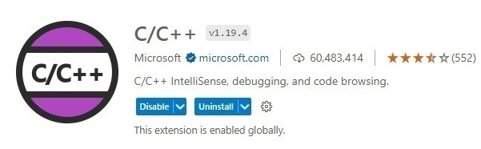
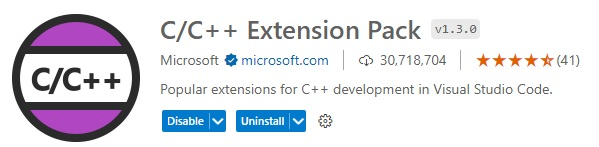
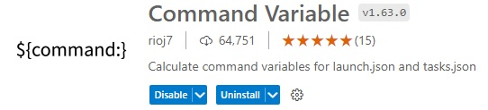
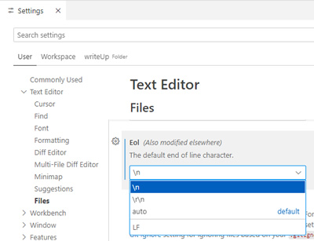
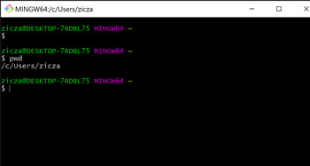
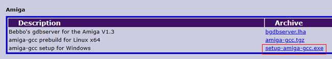
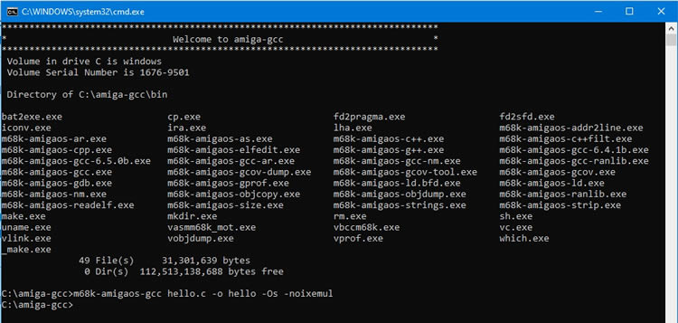
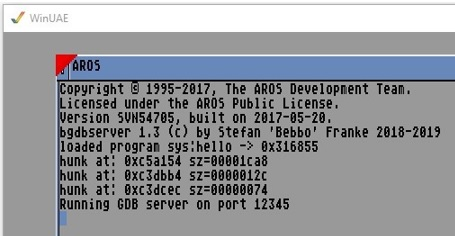

Install and Plugins
====

Visual Studio Code and Plug Ins
----

Download and Install [Visual Studio Code ](https://code.visualstudio.com/download)(VS Code) for Windows and install these plugins:
 

VS Code Settings
--
Go to 'Settings\Text Editor\Files, scroll down to 'Eol' and change end of line settings from 'auto' to '\n' 

This will allow you to safely edit Amiga Startup-Sequence in VS Code, 
Otherwise you will see 'object not found' messages in Amiga cli when UAE starts up.

Git 
--
Download and install Git and Git Bash for Windows for easier access to the various repositories.

Bebbo amiga-gcc setup for Windows
---

go to https://franke.ms/Downloads.wiki#Amiga, download and install 'setup-amiga-gcc.exe'.

The default installation folder is **c:\amiga-gcc** and is the expected path for this setup in VS Code. If a different install path is chosen, then you'll need to update any references in  VS Code.

``note: this installs a 64-bit version of gcc.exe.``

After gcc install, run **cmdline.bat** in the installation folder. 
This will tell you the compiler is actually working but it also to creates a make.exe file which is used later by our Makefile.

Also on https://franke.ms/Downloads.wiki#Amiga is bgdbserver which is used for source level debugging.
 v1.3 is alreay located in the uae\DH0\c folder but may be worth checking if there is a newer version from Bebbo.

