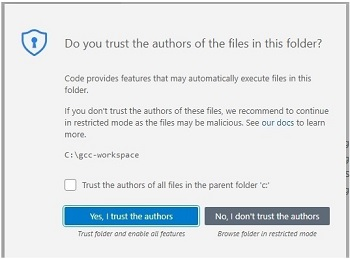

VS Code Workspace
====

To download the project workspace, open Git Bash and issue the following command to grab the workspace from the remote repo and put it in a folder called vscode-amiga-gcc-example on the c drive:

```
git clone https://github.com/0wen101/vscode-amiga-gcc-example-prb28 /c/gcc-workspace/
```

When done, open the code-workspace in VS Code (File menu, Open Workspace From File..).

You may get a warning from VS Code to trust the workspace. Just select the 'Yes, I trust the Authors' button




