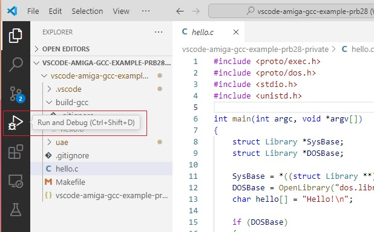
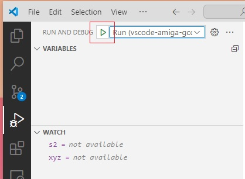
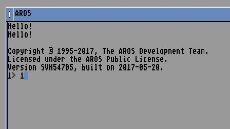

Run 
===

Select Run and Debug on the side bar (Ctrl Shift D) 

and select the 'Run' configuration. Click the play icon (or press F5) to start WinUAE. 

The Startup-Sequence file (in uae\DHO\s ) is set to run the compiled exe on startup.

If get 'object not found', check 'EOL' characters in the startup-sequence file is Linux (LF) rather than Windows (CRLF). 

See note in installs page re changing settings in VS Code.