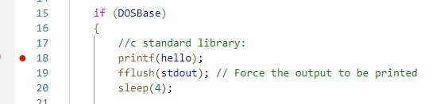
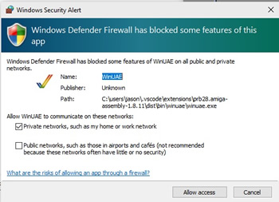
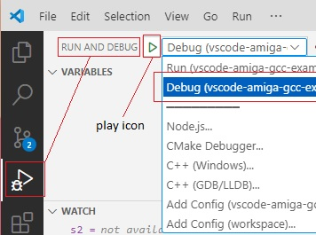
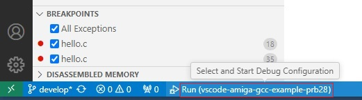
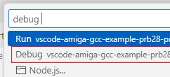
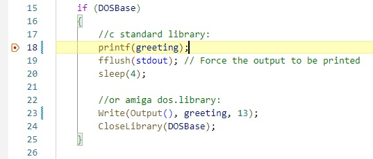
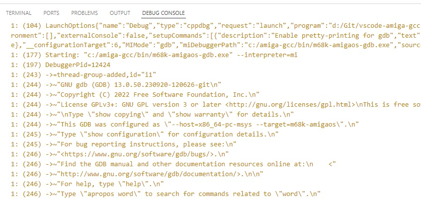
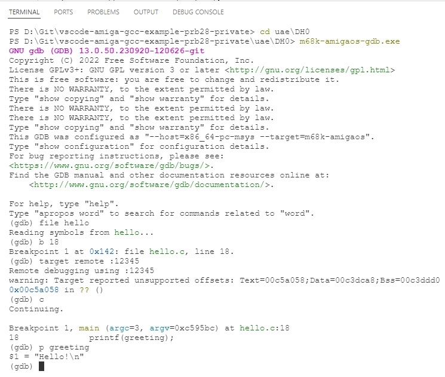

Debugging
===

Debugging, while a bit convoluted, is essentially a two step process:

**Step 1**. the run step - start a 'gdbserver' debugging session of the 'hello' executable on the target (Amiga) 

**Step 2**. the debug step - run 'gdb' to connect to that session remotely from the host (Windows) 

As mentioned, Bebbo has already created an Amiga versions of these -  bgdbserver & m68k-amigaos-gdb.

a) the run step
----
Before running, the Startup-Sequence will need an edit to run the compiled executable with  bgdbserver. <br>Click the Startup-Sequence file in the 'uae\DHO\s' folder to open it VS Code for editing. <br>Edit it so looks like this (the hello line is commented out, the bgdbserver and UAEquit lines are enabled) :

```
;hello

bgdbserver :12345 sys:hello /r /n

; Quits the emulator at the end of the program
UAEquit
```
<br>Next, open hello.c and put a breakpoint on line 18:



As before Select Run and Debug on the VS Code side bar and select the 'Run' configuration. Click the play icon (or press F5) to start WinUAE. 

You may get a warning from VS Code to trust the workspace. Just select the 'Yes, I trust the Authors' button


Windows defender will request to allow access to winuae. Click Allow access.



You should then see GDB server running on WinUAE and waiting for a connection on port 12345:


b) the debug step (VS Code)
----

Once WinuUAE and gdb server have started, click Run and Debug on the VS Code side bar again and this time select the 'Debug' configuration from the drop down menu. Click the play icon to connect m68k-amigaos-gdb on Windows to gdb server running on WinUAE.



Unfortunately, and more often than not, VS Code will display the busy loading indicator (a thin blue moving bar) in the Run & Debug Window once the first Run configuration and the WinUAE process has started.
<br> 
This will prevent the Debug or another configuration from being selected and started.

In this case, click the bottom bar on VS Code (where it says 'Run (vscode-amiga-gcc-example)' 




and select the Debug configuration from the popup list:




VS Code should then stop the WinUAE process at first breakpoint. Use the VS Code debug toolbar to continue or step over, watch a variable or whatever.


<H6 style="margin-top: -15px"><b>line 18 breakpoint hit</b></H6>


If enabled, GDB debug output is displayed in the Debug Console Window when Debug is selected. <br>If not you will see Debug info from WinUAE.<br>To enable GDB debug output, open the launch.json file and change 'engineLogging' from false to true.


<H6 style="margin-top: -15px"><b>vscode debug output for process 'm68k-amigaos-gdb'</b></H6>

Any input in the VS Code debug console (when the debugger is running) is interpreted as an 'evaluate variable' command. <br>So for example, to evaluate or 'watch' the variable 'greeting' just type greeting and press enter.

b) the debug step (command line)
----
To help understand the process,  it's useful to see the same m68k-amigaos-gdb commands that VS Code is running visually.<br>
Stop VS Code if still running (click the red 'square' icon or shift-F5), close WinUAE if still open and repeat the run step again.

Once WinuUAE and bgdbserver have started, go to the VS Code Terminal window and press any key to close the current task if there's one open and type these commands one by one (press Enter after each statement):

```
cd uae\DH0
<press Enter>

m68k-amigaos-gdb.exe
<press Enter>

file hello
<press Enter>

b 18
<press Enter>

target remote :12345
<press Enter>

c
<press Enter>

p greeting
```

What's happening is m68k-amigaos-gdb.exe starts and loads symbols from a file called hello. A breakpoint is set on line 18 and then connects to a remote session on port 12345. 'c' is 'continue until a breakpoint is reached' and then 'p' prints out variable called greeting.


<H6 style="margin-top: -20px"><b>typing debugger commands in the VS Code Terminal  </b></H6>
