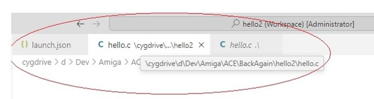

Issues Encountered and Any Other Notes
===
<H6><b>> debugger not attaching to source code or stopping at breakpoint.</b></H6>
open launch.json debug config and edit the value for sourcefilemap 
comment out out the default value ("/" : "c:/") and try changing to one of the different values there e.g. "/" : "d:/" if you are on a d drive

***
<H6><b>> cannot start the debug step in vs code Run & Debug</b></H6>
VS Code is probably busy/stuck on a backround process. 
A thin blue bar or loading indicator in the Run&Debug window would indicate that.
Try following the alternative method described in 'the debug step (VS Code)' in the previous page.
 
 

***

<H6><b>'object not found' error in WinUAE when try running bgdbserver</b></H6>
check that line endings are set to '\n' and not '\r\n'

or open source file in notepad++ change line endings from windows to unix
CR LF
to CR

***

<H6><b>Error in gdb output when debugger fails to attach: unexpected end of file Unhandled Rejection at Promise [object Promise]</b></H6>
no idea. 'Unhandled promise Rejection' in vs code

***
<H6><b>error 'unable to create variable object'</b></H6>

get this a lot when try and add a watch to a variable.
possibly an issue with this particular version of gcc and gdb.
Seems to apply to local variables outside of current scope.

***
<H6><b>error 'Unable to start debugging. Unexpected GDB output from command...'</b></H6>

Try changing the port number to something else in launch.json and the startup-sequence and retry. Also check windwows defender firewall is not blocking bgdbserver

***
<H6><b>Unable to start debugging. Program path <some_windows_path> is missing or invalid</b></H6>

check the path value for variable 'program' in launch.json
turn on debug logging (see below) and search the log for 'No such file or directory'
usually the result of wrong direction slash character in the path to the executable program being debugged.

***

<H6><b>error 'The editor could not be opened because the file was not found' or 'No source file named named hello.c' or breakpoints set but vs code not stopping at them</b></H6>

I get this if on a drive other than c drive sometimes. 
With debug logging switched on (see below), check the paths gdb is looking for versus the actual path to the file in question. 
If different, then as said above, you will need to edit sourcefilemap in launch.json debug config and try a different value so the windows path gets mapped correctly for gdb.

<H6 style="margin-top: -20px"><b>gdb looking for a cygdrive path instead of windows path</b></H6>
 

 questions
===
Q.How to turn on debug logging info in gcc ? A.open launch.json, go to debug configuration and under logging set the engineLogging key to True.